<div align="center">


# Mediastarr

**EN** · [DE](#de)

[](https://mediastarr.de/)
[](https://hub.docker.com/r/kroeberd/mediastarr)
[](https://github.com/kroeberd/mediastarr/releases)
[](LICENSE)
[](https://discord.gg/8Vb9cj4ksv)

</div>

---

<!-- ENGLISH -->
<a name="en"></a>

**Automated missing-content and quality-upgrade search for Sonarr & Radarr.**  
Runs on a configurable schedule, keeps a SQLite history, sends rich Discord embeds, and has a first-run browser wizard. No config file editing required.

> **Note:** Independent project, built from scratch. Not affiliated with Huntarr.

---

## ✨ Features

| Feature | Details |
|---|---|
| 📺 Multiple Sonarr instances | Missing + Upgrades · Episode / Season / Series mode |
| 🎬 Multiple Radarr instances | Missing + Upgrades |
| 🏷️ Custom names | Sonarr 4K, Anime, Radarr HD — each with its own card |
| 🧙 First-run wizard | Browser-based, no config file editing |
| 🗄️ SQLite history | Title, year, type, result, search count, timestamps |
| ⏳ Cooldown | 1–365 days, resets automatically |
| 📊 Daily limit | Max searches/day (0 = unlimited) |
| 🎲 Random selection | Items picked randomly per cycle for even coverage |
| ⭐ IMDb filter | Min. rating — global or per Sonarr/Radarr tab |
| 🎯 Target resolution | Only upgrade below your quality target |
| 🔢 Upgrade daily limit | Separate limit for upgrades — global, per Sonarr/Radarr type, or per instance |
| 🔒 API key censoring | API keys are masked in activity log and never returned in API responses |
| ⚡ Stalled download monitor | Automatically detects stuck downloads and triggers a new search (queue API-based) |
| ⏱ Jitter | Random ±N sec offset per cycle |
| 🔔 Discord | Rich embeds: poster + fanart, IMDb/TVDB/TMDB links, ratings, genres, runtime |
| 📊 Stats report | Periodic Discord embed with progress bar + per-instance table |
| 🌐 Multilingual | German & English (UI, logs, Discord messages) |
| 🎨 4 themes | Dark / Light / OLED / System |
| 🕐 Timezone | IANA timezone picker, respects `TZ` env var |
| 🔒 Security | CSRF protection, optional password, brute-force lockout, `config.json` set 0600 |
| 🖥 MSLog | Browser console logger: TRACE/DEBUG/INFO/WARN/ERROR with timestamps |
| 📅 Per-instance daily limit | Each instance can have its own search limit per day |
| 💾 Config backup | Export / import full config as JSON (incl. API keys) |
| 🔓 Public API mode | `/api/state` optionally accessible without login — for external tools |
| 🏷️ Tag tagging | Add a tag to processed items in Sonarr/Radarr for easy filtering |
| 🔖 Tag-based filtering | Per-instance: only search items that carry specific tags (e.g. seasonal collections) |
| 🔔 Separate Discord webhooks | Different webhook URL for Sonarr vs Radarr notifications |
| 🔗 Webhook trigger | `POST /api/webhook/trigger` — trigger a cycle from external automation |

---

## 🚀 Quick Start

```bash
docker run -d \
  --name mediastarr \
  --restart unless-stopped \
  -p 7979:7979 \
  -v /your/appdata/mediastarr:/data \
  -e TZ=Europe/Berlin \
  kroeberd/mediastarr:latest
```

Open **http://your-server:7979** — the setup wizard starts automatically.

## 🐳 Docker Compose

```yaml
services:
  mediastarr:
    image: kroeberd/mediastarr:latest
    container_name: mediastarr
    restart: unless-stopped
    ports:
      - "7979:7979"
    volumes:
      - /your/appdata/mediastarr:/data
    environment:
      - TZ=Europe/Berlin
      # - MEDIASTARR_PASSWORD=change-me   # optional
```

## 📦 Unraid

Install via **Community Apps** — search for `Mediastarr`.  
Or use the template: [`mediastarr.xml`](mediastarr.xml)

## ⚙️ Environment Variables

| Variable | Default | Description |
|---|---|---|
| `TZ` | `UTC` | IANA timezone, e.g. `Europe/Berlin` |
| `MEDIASTARR_PASSWORD` | *(empty)* | Dashboard + API password. Leave empty for open access. |
| `SONARR_URL` | *(empty)* | Pre-fill Sonarr URL (skips wizard for this instance) |
| `SONARR_API_KEY` | *(empty)* | Pre-fill Sonarr API key (requires `SONARR_URL`) |
| `RADARR_URL` | *(empty)* | Pre-fill Radarr URL |
| `RADARR_API_KEY` | *(empty)* | Pre-fill Radarr API key (requires `RADARR_URL`) |

## 🔔 Discord Notifications

Settings → **Discord** tab:

1. In Discord: Right-click channel → **Edit Channel** → Integrations → Webhooks → **New Webhook**
2. Copy the URL (`https://discord.com/api/webhooks/ID/TOKEN`)
3. Paste into Mediastarr → **Save** → **Send test**

**6 event types** — each with a message preview in the UI:

| Event | Embed | Colour |
|---|---|---|
| 🔍 Missing searched | Poster + fanart, links, rating, genre, runtime, status | 🟢 Green |
| ⬆️ Upgrade searched | Same as missing + current quality field | 🟡 Yellow |
| ⏳ Cooldown expired | Item count, next run, cooldown setting | 🔵 Blue |
| 🚫 Daily limit reached | Progress bar `████████░░`, reset time | 🔴 Red |
| 📡 Instance offline | Error message, URL, service type | ⚫ Grey |
| 📊 Statistics report | Progress bar, KPIs, per-instance table | 🟠 Orange |

## 🛡️ Security

- Optional password via `MEDIASTARR_PASSWORD` env var
- CSRF token on all state-mutating requests
- Brute-force protection: 10 failed logins → 5 min IP lockout
- API keys never returned in `/api/state` responses
- SSRF protection on all URL inputs
- `config.json` chmod 0600 on every save
- Security headers: `X-Frame-Options`, `X-Content-Type-Options`, `Referrer-Policy`, CSP

## 🔌 API Reference

All endpoints require authentication if a password is configured (header `X-Api-Key: <your-password>` or cookie session). Set `public_api_state: true` in config to expose `/api/state` without auth.

| Method | Endpoint | Description |
|--------|----------|-------------|
| `GET` | `/api/state` | Full application state: running status, config, per-instance stats, cycle info |
| `POST` | `/api/control` | Control the service — body: `{"action":"start"}` / `{"action":"stop"}` / `{"action":"run_now"}` |
| `POST` | `/api/config` | Save configuration — full config object in JSON body |
| `GET` | `/api/config/export` | Download current config as JSON |
| `POST` | `/api/config/import` | Import config from JSON |
| `GET` | `/api/instances` | List all configured instances |
| `POST` | `/api/instances` | Add a new instance — body: `{"type":"sonarr","name":"…","url":"…","api_key":"…"}` |
| `PATCH` | `/api/instances/<id>` | Update instance fields (name, url, api_key, enabled, daily_limit, search_upgrades, tag_enabled, tag_filter_ids) |
| `DELETE` | `/api/instances/<id>` | Remove an instance |
| `GET` | `/api/instances/<id>/ping` | Test connectivity to a Sonarr/Radarr instance |
| `GET` | `/api/instances/<id>/tags` | Fetch available tags from the instance (for tag-filter UI) |
| `GET` | `/api/history` | Paginated search history (SQLite) — params: `?page=1&per_page=50` |
| `GET` | `/api/history/stats` | Aggregate stats: total searches, per-year breakdown, result counts |
| `POST` | `/api/history/clear` | Clear all search history |
| `POST` | `/api/history/clear/<id>` | Clear history for one instance |
| `POST` | `/api/webhook/trigger` | Trigger an immediate hunt cycle from external automation (e.g. Sonarr/Radarr webhooks) |
| `GET` | `/api/queue/stalled` | List currently stalled downloads detected across all instances |

### Webhook trigger example

```bash
curl -X POST http://your-server:7979/api/webhook/trigger \
  -H "X-Api-Key: your-password" \
  -H "Content-Type: application/json" \
  -d '{"source":"sonarr"}'
```

---

## 🔌 API-Endpunkte

Alle Endpunkte erfordern Authentifizierung wenn ein Passwort konfiguriert ist (Header `X-Api-Key: <dein-passwort>` oder Session-Cookie). Mit `public_api_state: true` in der Config ist `/api/state` ohne Auth zugänglich.

| Methode | Endpunkt | Beschreibung |
|---------|----------|--------------|
| `GET` | `/api/state` | Vollständiger App-State: Laufstatus, Konfiguration, Instanz-Stats, Zyklus-Info |
| `POST` | `/api/control` | Steuerung — Body: `{"action":"start"}` / `{"action":"stop"}` / `{"action":"run_now"}` |
| `POST` | `/api/config` | Konfiguration speichern — vollständiges Config-Objekt als JSON |
| `GET` | `/api/config/export` | Aktuelle Konfiguration als JSON herunterladen |
| `POST` | `/api/config/import` | Konfiguration aus JSON importieren |
| `GET` | `/api/instances` | Alle konfigurierten Instanzen auflisten |
| `POST` | `/api/instances` | Neue Instanz hinzufügen — Body: `{"type":"sonarr","name":"…","url":"…","api_key":"…"}` |
| `PATCH` | `/api/instances/<id>` | Instanzfelder aktualisieren (name, url, api_key, enabled, daily_limit, search_upgrades, tag_enabled, tag_filter_ids) |
| `DELETE` | `/api/instances/<id>` | Instanz entfernen |
| `GET` | `/api/instances/<id>/ping` | Verbindung zu einer Sonarr/Radarr-Instanz testen |
| `GET` | `/api/instances/<id>/tags` | Verfügbare Tags der Instanz abrufen (für Tag-Filter) |
| `GET` | `/api/history` | Suchverlauf (SQLite) — Parameter: `?page=1&per_page=50` |
| `GET` | `/api/history/stats` | Statistiken: Gesamtsuchen, Jahresaufschlüsselung, Ergebnis-Counts |
| `POST` | `/api/history/clear` | Gesamten Suchverlauf löschen |
| `POST` | `/api/history/clear/<id>` | Verlauf einer Instanz löschen |
| `POST` | `/api/webhook/trigger` | Sofortigen Such-Zyklus auslösen — für externe Automatisierung (z.B. Sonarr/Radarr-Webhooks) |

### Webhook-Trigger Beispiel

```bash
curl -X POST http://dein-server:7979/api/webhook/trigger \
  -H "X-Api-Key: dein-passwort" \
  -H "Content-Type: application/json" \
  -d '{"source":"sonarr"}'
```

---

## 📸 Screenshots

| Dashboard | Settings | Discord | Mobile |
|-----------|----------|---------|--------|
| 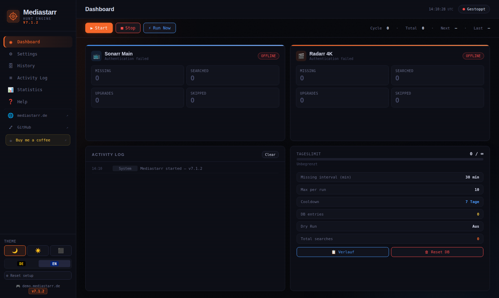 |  | 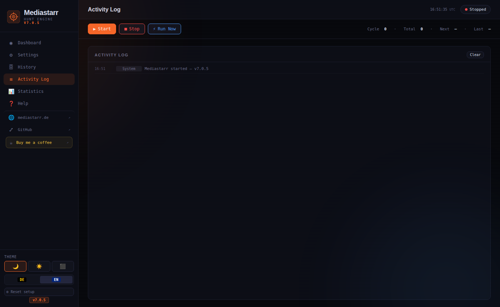 | 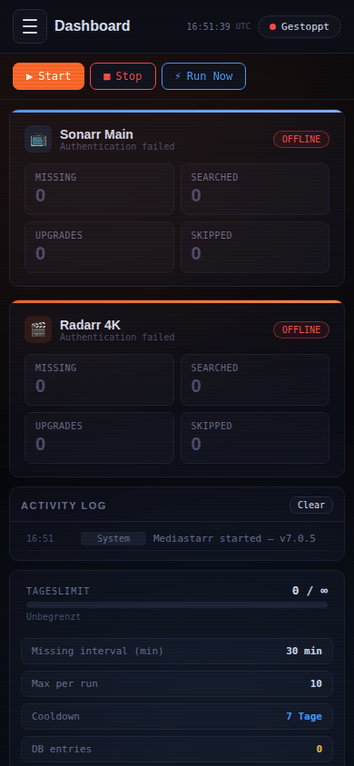 |


| Dashboard | Settings | Discord |
|:---:|:---:|:---:|
| 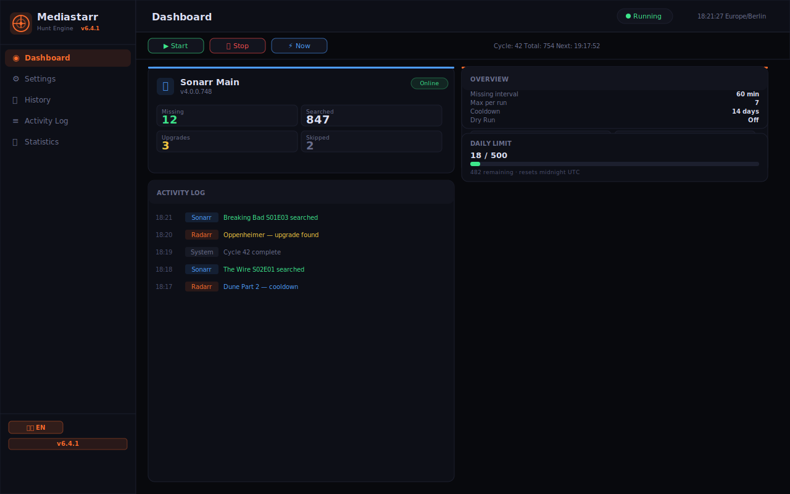 | 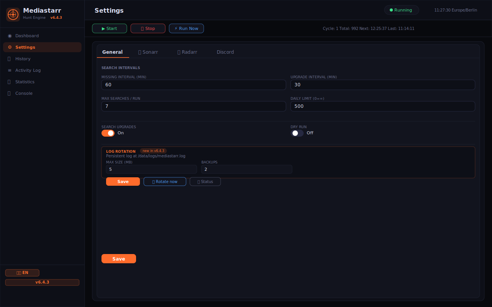 | 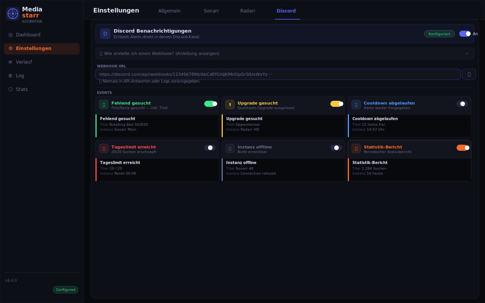 |

| History | DC Notifications | Console Logger |
|:---:|:---:|:---:|
|  |  | 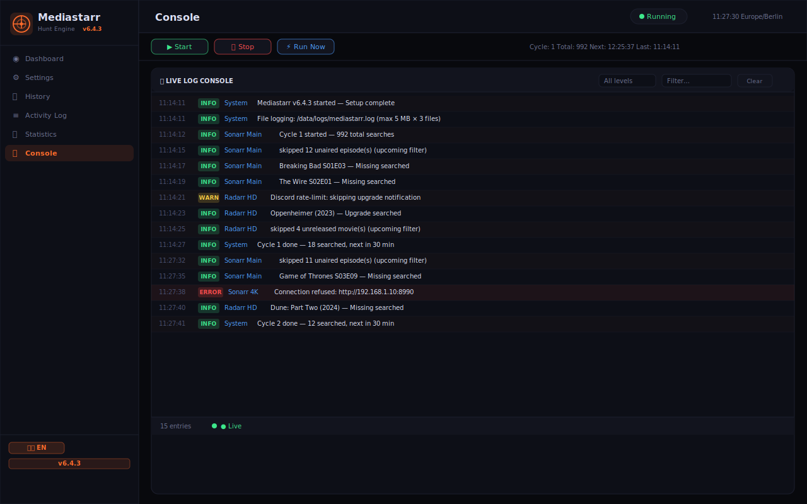 |

## 🗺️ Roadmap / Ideas

- [x] Per-instance daily limits *(v6.4.1)*
- [x] Export/import config *(v6.4.1)*
- [x] Read-only API mode (no auth required for `/api/state`) *(v6.4.1)*
- [x] Skip upcoming/unreleased content *(v6.4.3)*
- [x] Scheduled maintenance windows *(v6.4.4)*
- [x] Per-instance upgrade toggle *(v6.4.6)*
- [x] Structured logging (DEBUG/INFO/WARN/ERROR) *(v7.0.0)*
- [x] Separate upgrade daily limit *(v7.0.6)*
- [x] Tag-based filtering per instance *(v7.0.5)*
- [x] Separate Discord webhooks for Sonarr/Radarr *(v7.0.5)*
- [x] Webhook trigger endpoint *(v7.0.5)*
- [x] Tagging of searched items in Sonarr/Radarr *(v7.0.4)*
- [x] API key censoring in logs *(v7.1.0)*
- [x] Stalled download monitor *(v7.1.0)*
- [ ] Push via Gotify / Apprise (alternative to Discord)
- [ ] Per-indexer or per-profile stall settings
- [ ] Import list support

## 🔒 Why not Huntarr or its forks?

In February 2026, a public security audit of Huntarr v9.4.2 uncovered **21 vulnerabilities — 7 critical, 6 high**. The most severe finding: a single unauthenticated HTTP request returned every API key for every connected *arr application in cleartext. No login required. The project's GitHub repository, subreddit and Discord were taken offline shortly after.

```bash
# Anyone on your network could run this against a stock Huntarr install:
curl -X POST http://huntarr:9705/api/settings/general \
  -H "Content-Type: application/json" \
  -d '{"proxy_enabled": true}'
# → Full config dump: Sonarr API key, Radarr API key, Prowlarr API key — all in cleartext
```

Community forks have appeared, but they inherit the same codebase. As the security researcher noted: *"Fixing 21 specific findings doesn't fix the process that created them."*

Mediastarr was built independently from scratch — with security as a foundation, not an afterthought.

> Security findings: [github.com/rfsbraz/huntarr-security-review](https://github.com/rfsbraz/huntarr-security-review) (Feb 2026).

---

<!-- DEUTSCH -->
<a name="de"></a>

---

<div align="center">

**DE** · [EN](#en)

</div>

---

**Automatische Suche nach fehlenden Inhalten und Qualitäts-Upgrades für Sonarr & Radarr.**  
Läuft nach einem konfigurierbaren Zeitplan, führt eine SQLite-Historie, sendet reiche Discord-Embeds und hat einen Browser-Einrichtungsassistenten. Kein Bearbeiten von Config-Dateien erforderlich.

> **Hinweis:** Eigenständiges Projekt, von Grund auf neu entwickelt. Keine Verbindung zu Huntarr.

---

## ✨ Features

| Feature | Details |
|---|---|
| 📺 Mehrere Sonarr-Instanzen | Fehlend + Upgrades · Modus: Episode / Staffel / Serie |
| 🎬 Mehrere Radarr-Instanzen | Fehlend + Upgrades |
| 🏷️ Eigene Namen | Sonarr 4K, Anime, Radarr HD — jede mit eigener Karte |
| 🧙 Erster-Start-Assistent | Browser-basiert, keine Config-Datei nötig |
| 🗄️ SQLite-Historie | Titel, Jahr, Typ, Ergebnis, Suchanzahl, Zeitstempel |
| ⏳ Cooldown | 1–365 Tage, automatisches Zurücksetzen |
| 📊 Tageslimit | Max. Suchen/Tag (0 = unbegrenzt) |
| 🎲 Zufällige Auswahl | Items zufällig gewählt für gleichmäßige Abdeckung |
| ⭐ IMDb-Filter | Mindestbewertung — global oder pro Sonarr/Radarr-Tab |
| 🎯 Zielauflösung | Nur upgraden wenn unter der Zielqualität |
| ⏱ Jitter | Zufälliger ±N-Sek-Offset pro Zyklus |
| 🔔 Discord | Reiche Embeds: Poster + Fanart, IMDb/TVDB/TMDB-Links, Bewertungen, Genre, Laufzeit |
| 📊 Statistik-Bericht | Periodisches Discord-Embed mit Fortschrittsbalken + Instanz-Tabelle |
| 🌐 Mehrsprachig | Deutsch & Englisch (UI, Logs, Discord-Nachrichten) |
| 🎨 4 Themes | Dark / Light / OLED / System |
| 🕐 Zeitzone | IANA-Zeitzonenwahl, respektiert `TZ`-Umgebungsvariable |
| 🔒 Sicherheit | CSRF-Schutz, optionales Passwort, Brute-Force-Lockout, `config.json` 0600 |
| 🖥 MSLog | Browser-Konsolen-Logger: TRACE/DEBUG/INFO/WARN/ERROR |
| 📅 Pro-Instanz Tageslimit | Jede Instanz kann ihr eigenes Tageslimit haben |
| 💾 Config-Backup | Export / Import der gesamten Konfiguration als JSON (inkl. API-Keys) |
| 🔓 Öffentlicher API-Modus | `/api/state` optional ohne Login erreichbar — für externe Tools |

---

## 🚀 Schnellstart

```bash
docker run -d \
  --name mediastarr \
  --restart unless-stopped \
  -p 7979:7979 \
  -v /dein/appdata/mediastarr:/data \
  -e TZ=Europe/Berlin \
  kroeberd/mediastarr:latest
```

Öffne **http://dein-server:7979** — der Setup-Assistent startet automatisch.

## 🐳 Docker Compose

```yaml
services:
  mediastarr:
    image: kroeberd/mediastarr:latest
    container_name: mediastarr
    restart: unless-stopped
    ports:
      - "7979:7979"
    volumes:
      - /dein/appdata/mediastarr:/data
    environment:
      - TZ=Europe/Berlin
      # - MEDIASTARR_PASSWORD=change-me   # optional
```

## 📦 Unraid

Installation über **Community Apps** — nach `Mediastarr` suchen.  
Oder Template verwenden: [`mediastarr.xml`](mediastarr.xml)

## ⚙️ Umgebungsvariablen

| Variable | Standard | Beschreibung |
|---|---|---|
| `TZ` | `UTC` | IANA-Zeitzone, z.B. `Europe/Berlin` |
| `MEDIASTARR_PASSWORD` | *(leer)* | Dashboard + API-Passwort. Leer lassen für offenen Zugang. |
| `SONARR_URL` | *(leer)* | Sonarr-URL vorausfüllen (überspringt Wizard für diese Instanz) |
| `SONARR_API_KEY` | *(leer)* | Sonarr-API-Key vorausfüllen (benötigt `SONARR_URL`) |
| `RADARR_URL` | *(leer)* | Radarr-URL vorausfüllen |
| `RADARR_API_KEY` | *(leer)* | Radarr-API-Key vorausfüllen (benötigt `RADARR_URL`) |

## 🛡️ Sicherheit

- Optionales Passwort über `MEDIASTARR_PASSWORD`
- CSRF-Token bei allen zustandsändernden Requests
- Brute-Force-Schutz: 10 Fehlversuche → 5 Min. IP-Lockout
- API-Keys nie in `/api/state`-Antworten enthalten
- SSRF-Schutz auf allen URL-Eingaben
- `config.json` chmod 0600 bei jedem Speichern
- Sicherheits-Header: `X-Frame-Options`, `X-Content-Type-Options`, `Referrer-Policy`, CSP

## 🗺️ Roadmap / Ideen

- [x] Pro-Instanz Tageslimits *(v6.4.1)*
- [x] Konfiguration exportieren/importieren *(v6.4.1)*
- [x] Read-only-API-Modus (kein Auth für `/api/state`) *(v6.4.1)*
- [x] Upcoming/unveröffentlichte Inhalte überspringen *(v6.4.3)*
- [x] Wartungsfenster (Pause zu bestimmten Uhrzeiten) *(v6.4.4)*
- [x] Pro-Instanz Upgrade-Toggle *(v6.4.6)*
- [x] Strukturiertes Logging (DEBUG/INFO/WARN/ERROR) *(v7.0.0)*
- [x] Separates Upgrade-Tageslimit *(v7.0.6)*
- [x] Tag-basierter Filter pro Instanz *(v7.0.5)*
- [x] Separate Discord-Webhooks für Sonarr/Radarr *(v7.0.5)*
- [x] Webhook-Trigger-Endpunkt *(v7.0.5)*
- [x] Tagging von durchsuchten Elementen *(v7.0.4)*
- [x] API-Key-Zensierung in Logs *(v7.1.0)*
- [x] Stalled-Download-Monitor *(v7.1.0)*
- [ ] Push via Gotify / Apprise (Alternative zu Discord)
- [ ] Pro-Indexer oder Pro-Profil Stall-Einstellungen
- [ ] Import-Listen-Unterstützung

## 🔒 Warum nicht Huntarr oder seine Forks?

Im Februar 2026 deckte ein öffentliches Sicherheitsaudit von Huntarr v9.4.2 **21 Schwachstellen auf — 7 kritisch, 6 hoch**. Die schwerwiegendste: Eine einzelne unauthentifizierte HTTP-Anfrage gab jeden API-Key jeder verbundenen *arr-Anwendung im Klartext zurück — ohne Login. GitHub-Repo, Subreddit und Discord wurden kurz darauf abgeschaltet.

```bash
# Jeder im Netzwerk konnte das gegen eine Standard-Huntarr-Installation ausführen:
curl -X POST http://huntarr:9705/api/settings/general \
  -H "Content-Type: application/json" \
  -d '{"proxy_enabled": true}'
# → Vollständiger Config-Dump: Sonarr-API-Key, Radarr-API-Key, Prowlarr-API-Key — alles im Klartext
```

Community-Forks sind entstanden — sie erben aber dieselbe Codebasis. Wie der Sicherheitsforscher schrieb: *„21 Findings zu fixen behebt nicht den Prozess, der sie erzeugt hat."*

Mediastarr wurde unabhängig, von Grund auf neu gebaut — mit Sicherheit als Fundament, nicht als Nachgedanke.

> Sicherheitsbefunde: [github.com/rfsbraz/huntarr-security-review](https://github.com/rfsbraz/huntarr-security-review) (Feb. 2026).

## 📸 Screenshots

| Dashboard | Einstellungen | Discord |
|:---:|:---:|:---:|
|  | 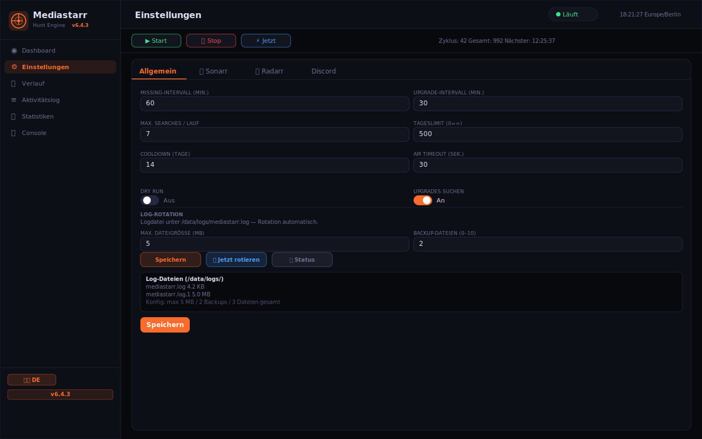 |  |

| Verlauf | DC Benachrichtigungen | Console Logger |
|:---:|:---:|:---:|
| 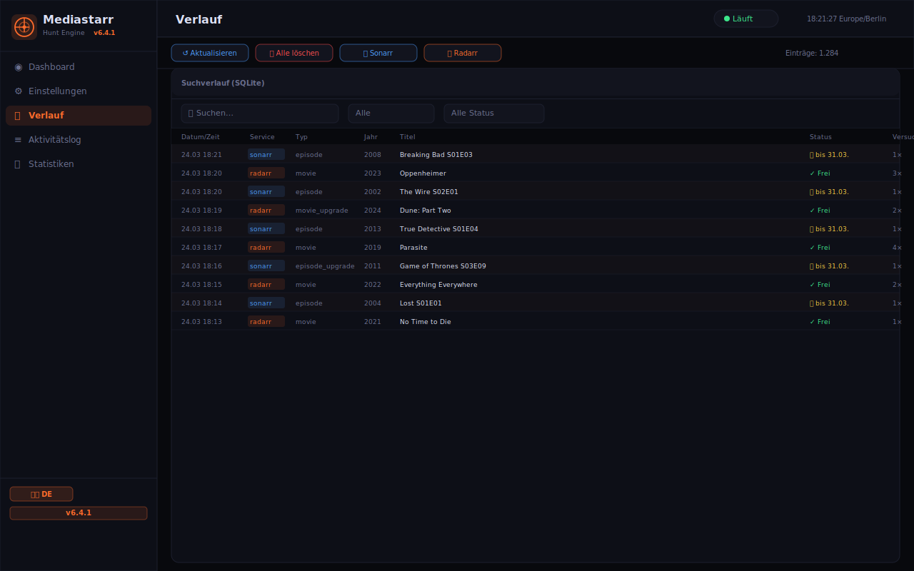 | 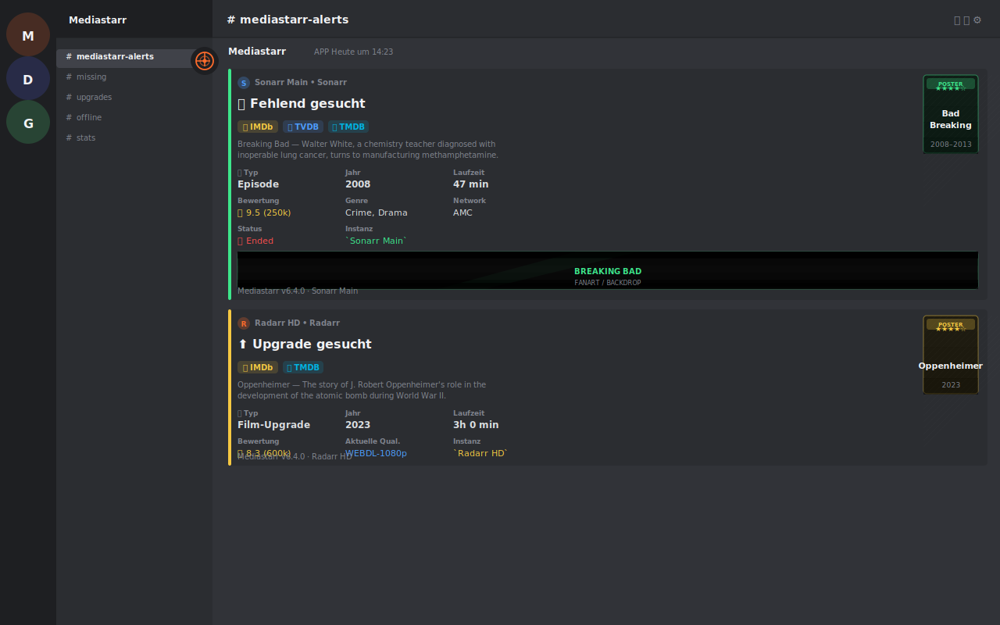 | 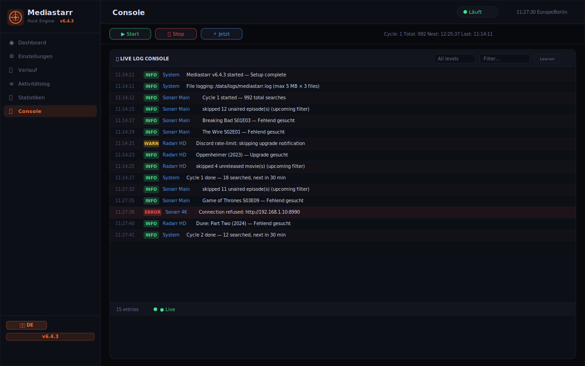 |

---

## 🤝 Contributing & Community

- **Contributing:** See [CONTRIBUTING.md](.github/CONTRIBUTING.md)
- **Security:** Report vulnerabilities via [SECURITY.md](.github/SECURITY.md) — please **do not** use public issues
- **Discord:** [discord.gg/8Vb9cj4ksv](https://discord.gg/8Vb9cj4ksv) for questions and support
- **Issues:** [Bug reports](.github/ISSUE_TEMPLATE/bug_report.yml) and [feature requests](.github/ISSUE_TEMPLATE/feature_request.yml) via GitHub

<div align="center">

Made with ❤️ · [mediastarr.de](https://mediastarr.de) · [Discord](https://discord.gg/8Vb9cj4ksv) · [Buy Me a Coffee](https://buymeacoffee.com/kroeberd)

</div>
